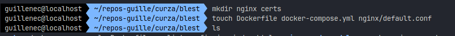
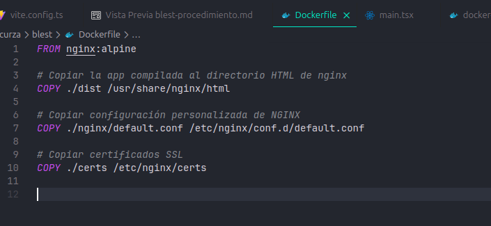

# 🛠️ Instalación y configuración de un servidor web con NGINX como proxy reverso + React + HTTPS (OpenSSL) usando Docker Compose

## Etapa 0 - Instalación desde cero Docker

**📆 Antes que nada: :**

```bash
 guillenec@localhost  ~  sudo apt update
 guillenec@localhost  ~  sudo apt upgrade
```

### 📦 instalación paquetes usando apt

Antes de instalar Docker Engine , debe configurar el apt repositorio de docker,podra instalar y actualizar docker desde el repositorio:

```bash
 guillenec@localhost  ~  sudo apt-get install ca-certificates curl

# Crear el directorio para claves
 guillenec@localhost  ~  sudo install -m 0755 -d /etc/apt/keyrings

# Descargar la clave GPG y guardarla como .asc
 guillenec@localhost  ~  sudo curl -fsSL https://download.docker.com/linux/ubuntu/gpg -o /etc/apt/keyrings/docker.asc

 guillenec@localhost  ~  sudo chmod a+r /etc/apt/keyrings/docker.asc 
 
```  

### ➕ Añadimos el repositorio de Docker

```bash
 guillenec@localhost  ~  echo \
  "deb [arch=$(dpkg --print-architecture) signed-by=/etc/apt/keyrings/docker.asc] https://download.docker.com/linux/ubuntu \
  $(. /etc/os-release && echo "${UBUNTU_CODENAME:-$VERSION_CODENAME}") stable" | \
  sudo tee /etc/apt/sources.list.d/docker.list > /dev/null

```

### 🔄 Actualizamos e instalamos Docker

```bash
 guillenec@localhost  ~  sudo apt update
 guillenec@localhost  ~  sudo apt-get install docker-ce docker-ce-cli containerd.io docker-buildx-plugin docker-compose-plugin

```

### 🔓 Habilitamos Docker para uso sin sudo

```bash
# Añadimos mi user al group docker

 guillenec@localhost  ~  sudo usermod -aG docker $USER

# Aplicamos cambios sin reiniciar

 guillenec@localhost  ~  newgrp docker

```

### ✅ Verificamos

```bash
 guillenec@localhost  ~  docker run hello-world

Hello from Docker!
This message shows that your installation appears to be working correctly.

To generate this message, Docker took the following steps:

 1. The Docker client contacted the Docker daemon.
 2. The Docker daemon pulled the "hello-world" image from the Docker Hub.
    (amd64)
 3. The Docker daemon created a new container from that image which runs the
    executable that produces the output you are currently reading.
 4. The Docker daemon streamed that output to the Docker client, which sent it
    to your terminal.

To try something more ambitious, you can run an Ubuntu container with:
 $ docker run -it ubuntu bash

Share images, automate workflows, and more with a free Docker ID:
 <https://hub.docker.com/>

For more examples and ideas, visit:
 <https://docs.docker.com/get-started/>

 guillenec@localhost  ~ 

```

## 📦 1. Crear el proyecto con Vite (React + Tailwind)

Desde mi carpeta de trabajo (por ejemplo ~/repos-guille/curza):

```bash
 guillenec@localhost  ~/repos-guille/curza  npm create vite@latest blest           

 # nos moemos al directorio de la app y instalamos los paquetes necesarios
 guillenec@localhost  ~/repos-guille/curza  cd blest
 guillenec@localhost  ~/repos-guille/curza/blest  npm i

 ```

### ✨ Instalacion Configuracion Tailwind

 ```bash
 guillenec@localhost  ~/repos-guille/curza/blest  npm install tailwindcss @tailwindcss/vite
 ```

**📂 vite.config.ts :**  
Archivo de configuracion de vite

 ```bash
 guillenec@localhost  ~/repos-guille/curza/blest  cat ./vite.config.ts
import { defineConfig } from 'vite'
import tailwindcss from '@tailwindcss/vite'
export default defineConfig({
  plugins: [
    tailwindcss(),
  ],
})

```

**📂 src/App.tsx (simplificado)**
Archivo principal de mi App, luego esta se modificara al instalar react router app

```bash
 guillenec@localhost  ~/repos-guille/curza/blest  cat ./src/App.tsx 
```

```tsx
// App.tsx
import { useState } from 'react'
// import reactLogo from './assets/react.svg'
// import viteLogo from '/vite.svg'
import './App.css'

function App() {
  const [isOpen, setIsOpen] = useState(false);
  const handleToggle = () => {
    setIsOpen(!isOpen);
  };
  
  return (
    <>
      <div className='w-full h-screen bg-green-200'>
      {/* header */}
      <header className='flex justify-between items-center p-4 bg-whiteCustom2 shadow-md'>
        <h1 className='text-2xl font-bold text-blackCustom1'>BlestApp Shop</h1>
        <button onClick={handleToggle} className='text-blackCustom1'>Menu</button>
      </header>
      {/* main */}
      <main className='flex flex-col items-center justify-center h-full'>
        <h1 className='text-4xl font-bold text-blackCustom1'>BlestApp Shop</h1>
        <p className='text-2xl font-bold text-blackCustom1'>Welcome to the BlestApp Shop</p>
      </main>
      {/* footer */}
      <footer className='flex justify-center items-center p-4 bg-whiteCustom2 shadow-md'>
        <p className='text-blackCustom1'>© 2025 BlestApp Shop</p>
      </footer>
    </div>
    </>
  )
}

export default App
 
 ```

### 🌐 Instalacion, configuracion react-router

```bash
guillenec@localhost  ~/repos-guille/curza/blest  npm i react-router
```

**📂 src/routes/AppRoutes.tsx**  
Estas son las rutas configuradas en mi App

```bash
guillenec@localhost  ~/repos-guille/curza/blest  cat ./src/routes/AppRoutes.tsx 
```

```tsx
import { Route, Routes } from "react-router"
import Home from "../pages/Home/Home"
import NotFound from "../pages/NotFound/NotFound"

function AppRoutes() {
  return (
    <Routes>
      <Route path="/" element={<Home />} />
      {/* <Route path="/products" element={<Products />} /> */}
      {/* <Route path="/cart" element={<Cart />} /> */}
      {/* <Route path="/about" element={<About />} /> */}
      <Route path="*" element={<NotFound />} />
    </Routes>
  )
}

export default AppRoutes
```


### ▶️ Paso 1.2: Probar en desarrollo (local)

```bash
 guillenec@localhost  ~/repos-guille/curza/blest  npm run dev
```


## 📁 ETAPA 2: Crear carpetas y archivos para Docker y NGINX

### 📦 2.1. Estructurar el entorno Docker

creamos la base de la organización de los archivos de configuración para Docker y NGINX.

```css
blest/
├── certs/                  → Certificados SSL generados con openssl
├── nginx/                  → Configuración del proxy reverso
│   └── default.conf
├── src/
│   ├── pages/
│   │   └── Home.jsx
│   └── App.jsx
├── Dockerfile
├── docker-compose.yml
```

```bash
 guillenec@localhost  ~/repos-guille/curza/blest  mkdir nginx certs
 guillenec@localhost  ~/repos-guille/curza/blest  touch Dockerfile docker-compose.yml nginx/default.conf
```

**📷 captura creacion de archivos**


**📷 captura árbol de directorios**


### 2.2 📔 Notas

* mkdir nginx: guarda los archivos de configuracion para el servidor NGINX.
* mkdir certs: Aquí almacenaremos los certificados SSL/TLS (por ejemplo, los generados por Let's Encrypt).
* Dockerfile: Este archivo contendrá las instrucciones paso a paso para construir la imagen Docker de la aplicación React/Vite. Es la "receta" para el contenedor frontend.
* docker-compose.yml: Este archivo YAML será la definición de la pila de servicios Docker. Aquí se especifica cómo Docker Compose debe construir y ejecutar el frontend, y eventualmente cómo NGINX actuará como proxy.
* nginx/default.conf: Este archivo contendrá la configuración específica de NGINX que le indicará cómo enrutar las solicitudes a tu aplicación frontend (actuando como proxy inverso).

## 🔐 ETAPA 3: Generar certificados autofirmados con openssl

openssl: es la herramienta de línea de comandos básica para crear y administrar certificados, claves, y otros archivos de OpenSSL.

```bash
 guillenec@localhost  ~/repos-guille/curza/blest  sudo openssl req -x509 -nodes -days 365 -newkey rsa:2048 -keyout ./certs/key.pem -out ./certs/cert.pem  
```

**📷 Captura creacion claves SSl**  


**📷 Captura estructura**  


## 🐳 ETAPA 4: Crear el Dockerfile

```bash
 guillenec@localhost  ~/repos-guille/curza/blest  cat ./Dockerfile
FROM nginx:alpine

# Copiar la app compilada al directorio HTML de nginx

COPY ./dist /usr/share/nginx/html

# Copiar configuración personalizada de NGINX

COPY ./nginx/default.conf /etc/nginx/conf.d/default.conf

# Copiar certificados SSL

COPY ./certs /etc/nginx/certs

 guillenec@localhost  ~/repos-guille/curza/blest 
```

**📷 Captura Dockerfile**  


## 🌐 ETAPA 5: Crear configuración NGINX con redirección HTTP → HTTPS

```bash
 guillenec@localhost  ~/repos-guille/curza/blest  cat ./nginx/default.conf 
# Redirige todo HTTP → HTTPS
server {
    listen 80;
    server_name localhost;
    return 301 https://$host$request_uri;
}
...
```

* Este bloque escucha en el puerto 80 (HTTP).
* Cualquier solicitud entrante por HTTP es redirigida con código 301 (redirección permanente) al mismo host pero con HTTPS.

```bash
...
# Servidor principal en HTTPS

server {
    # Escucha en el puerto 443 con SSL
    listen 443 ssl;
    # Nombre del servidor
    server_name localhost;

    # Configuración de SSL
    ssl_certificate /etc/nginx/certs/cert.pem;
    ssl_certificate_key /etc/nginx/certs/key.pem;

    # Configuración de la ubicación raíz
    location / {
      # Raíz del servidor
      root /usr/share/nginx/html;
      # Archivo de índice
      index index.html;
      # Intenta servir el archivo solicitado, si no existe, sirve index.html
      try_files $uri $uri/ /index.html;
      # El try_files es clave para que funcione bien React Router DOM (Single Page Application).
    }
}

```

* Este bloque atiende conexiones seguras en el puerto 443 (HTTPS).
* Carga el certificado SSL y su clave privada.
* Usa try_files para garantizar el correcto funcionamiento de React Router DOM.

**📷 Captura default.conf**  


### 📔 Nota nginx/default.conf

Esta es La Configuración del Servidor Web

* listen 443 ssl;: NGINX también escuchará las conexiones entrantes en el puerto 443 (el puerto estándar para HTTPS) y las configurará para usar SSL/TLS.
* server_name localhost;: Indica que este bloque de servidor responderá a solicitudes dirigidas al nombre de host localhost. En produccion aqui habria un dominio tipo <www.blest.com>
* ssl_certificate /etc/nginx/certs/cert.pem; y ssl_certificate_key /etc/nginx/certs/key.pem;: Estas líneas le dicen a NGINX dónde encontrar tus certificados SSL y su clave privada dentro del contenedor para habilitar la encriptación HTTPS.
* location / { ... }: Este bloque define cómo NGINX debe comportarse para cualquier solicitud que llegue a la raíz de tu sitio (/).
  * root /usr/share/nginx/html;: Establece el directorio /usr/share/nginx/html como la raíz de los documentos para este bloque. Es donde NGINX buscará tus archivos.
  * index index.html;: Si una solicitud se dirige a un directorio (como /), NGINX intentará servir index.html dentro de ese directorio.
  * try_files $uri $uri/ /index.html;: Esta es una configuración crucial para aplicaciones de "Single Page Application" (SPA) como las creadas con React y Vite. Significa:
    1. Intenta servir el archivo exacto solicitado ($uri).
    2. Si no es un archivo, intenta servir el directorio ($uri/).
    3. Si ninguna de las anteriores existe (ej. una ruta de la aplicación como /productos/123), entonces sirve siempre el index.html. esto es crusial para que si usamos react router d no devuelva un 404.

## 📦 ETAPA 6: Crear el docker-compose.yml

```bash
 guillenec@localhost  ~/repos-guille/curza/blest  cat ./docker-compose.yml 
services:
  web:
    build:
      context: .
    image: blest-web
    ports:
      - "5173:80"
      - "5443:443"
    volumes:
      - ./certs:/etc/nginx/certs
      - ./nginx/default.conf:/etc/nginx/conf.d/default.conf
```

* El puerto 5173 en mi maquina host se redirige al puerto 80 dentro del contenedor (donde nginx escucha).
* El puerto 5443 en mi maquina host se redirige al 443 interno del contenedor.
* Esto es una solución para evitar conflictos con servicios que ya están usando el 80 o 443 en mi máquina (como Apache).
  * El bloque listen 80 en NGINX sigue siendo correcto, porque ese puerto está mapeado desde tu host (5173 → 80).
  * Cuando accedemos a <https://localhost:5443>, internamente entra al puerto 443 del contenedor, así que todo funciona igual.

**📷 Captura docker-compose.yml**  


## 🔨 ETAPA 6: Compilar la app y desplegar

### compilamos

```bash
npm run build
```

**📷 Captura deploy App**  


### Desplegamos ejecutamos

```bsh
 guillenec@localhost  ~/repos-guille/curza/blest  docker compose up -d --build
```

**📷 Captura compose up**  


**Verificamos 📲 Acceso**


* **localhost:5443**


* **192.168.1.204:5443/**


* **192.168.1.204:5443/hoe**

  * para verificar si la page de error funciona


## detalle certificado


## ⛔️ Conflicto: Apache usando puerto 80

### esto me ocurrio en la primer prueba

⚠️ Error: address already in use en el puerto 80
Esto significa que ya hay otro servicio o contenedor ocupando el puerto 80 en tu sistema.

#### lista todos los procesos que tienen abierto o están escuchando en el puerto 80

```bash
 ✘ guillenec@localhost  ~/repos-guille/curza/shop-blest-buzos  sudo lsof -i :80
```

**📷 Captura compose lsoft**  


#### luego accedemos a <http://localhost>

**📷 Captura localhost navegador web**  


### 🧔‍♀️🪛 error Apache

que paso, nos salio la pagina de apache, esto es porque se ejecuta en el mismo puerto, por lo que tendremos que hacer stop del servicio:

🔧 SOLUCIÓN: Detener Apache temporalmente

```bash
sudo systemctl stop apache2
sudo systemctl disable apache2

```

#### Luego de corregir

```bash
 guillenec@localhost  ~/repos-guille/curza/shop-blest-buzos  docker compose down

# en este caso solo lo levantara, no en segundo plano
  guillenec@localhost  ~/repos-guille/curza/shop-blest-buzos  docker compose up --build
```

## ♻️ Limpieza final si hay errores

```bash
# Para limpiar contenedores e imágenes no utilizadas
docker system prune -a

```

**📷 Captura salida system pure -a**  


### Que hicimos

 Se elimino:

* Contenedores detenidos.
* Redes no usadas.
* Imágenes sin contenedores asociados.
* Caché de compilación.
  Y liberaste 278.6MB de espacio.

## ✅ Habilitar Apache nuevamente si se desea

reiniciar apache2 ya que ahora mo usamos el puerto 80:80 y ya no deberia haber conflictos con Nginx

```bash
sudo systemctl enable apache2
sudo systemctl start apache2
```

## buildiamos nuestro proyecto y levantamos el contenedor

```bash
npm run build
docker compose up -d --build
```
